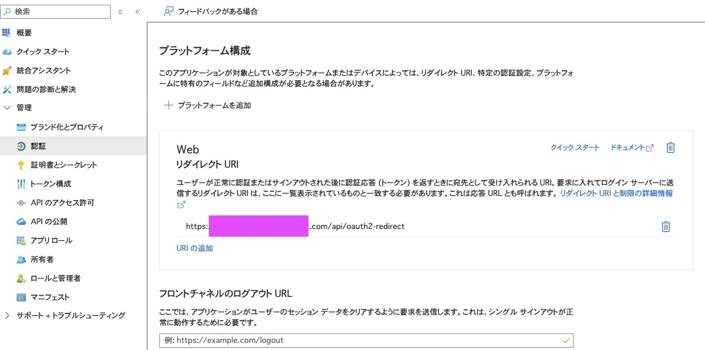
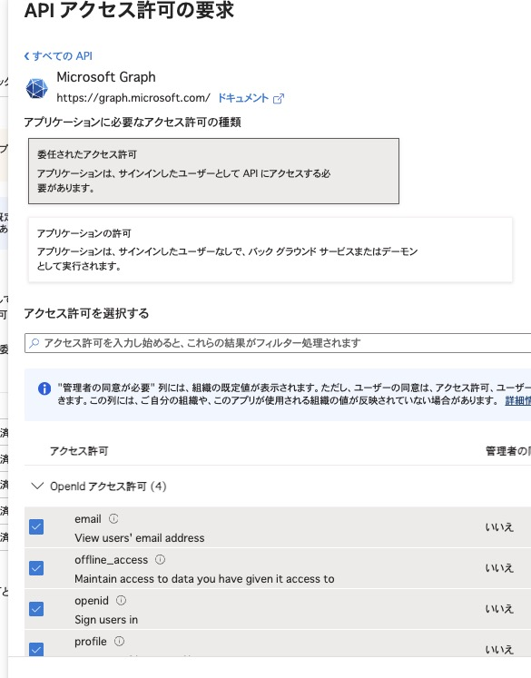
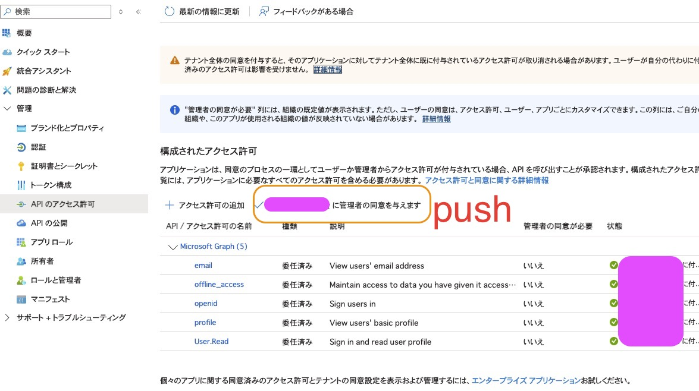
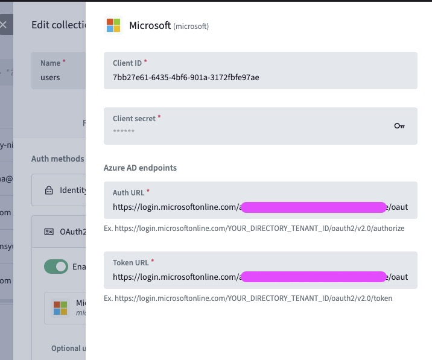
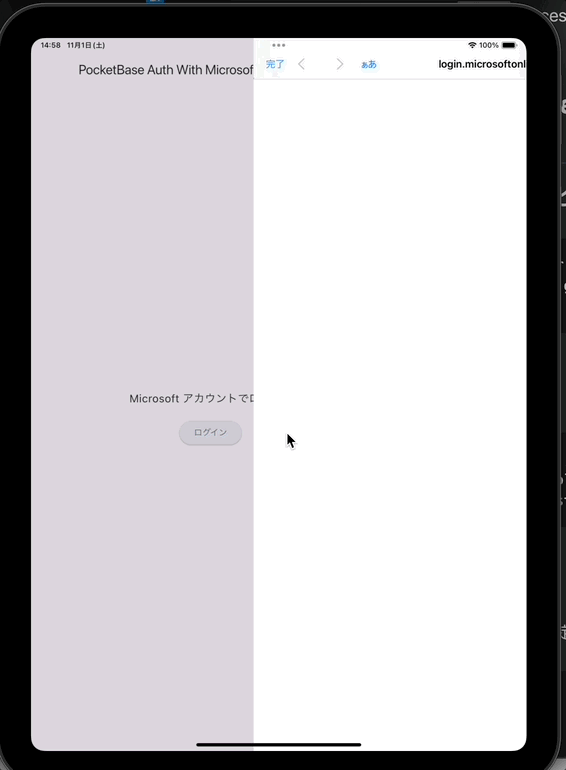

# some sample champloo

Flutterでいくつかの要素を詰め込んだサンプルおよびメモ

## pocketbase ms login sample

- Azure Portalにて **Webアプリとして** 登録（Not SPA）
  - Secret Valueを控えておく(Not **Secret ID**)
- リダイレクトURIのパスは`/api/oauth2-redirect`

- 登録したアプリに APIのアクセス許可 を Delegated Permission で与える
  - `email`, `offline_access`, `openaid`, `profile`
  - `User.Read`はデフォルトで付与されていた

- 管理者の同意を付与

- pocketbase の管理画面で users collection に microsoft provider を追加

- 控えておいた Secret Value, Client ID, 各種エンドポイントの値を設定


## pocketbase 認証画面
Pocketbase の users コレクションに登録したプロバイダを使ってログインしたい。
```dart
final authRecord = await pb.collection("users").authWithOAuth2("microsoft", (
  url,
) async {
  // ログイン画面を起動
});

```
`flutter_web_auth2`を使いたかったが**Associated Domain**とかを用意する必要がありそうで面倒ということが判明。

githubで既存のプロジェクトの実装をみてもほとんど`url_launcher`を使ってるため、妥協することにする



## SharedPreferences
Pocketbase で `AsyncAuthStore` を使い、認証状態を永続化するため

see: [https://github.com/pocketbase/dart-sdk?tab=readme-ov-file#authstore](https://github.com/pocketbase/dart-sdk?tab=readme-ov-file#authstore)

```dart
class AuthNotifier extends Notifier<RecordAuth?> {
  late final PocketBase _pb;

  @override
  RecordAuth? build() {
    _initializePocketBase();
    // AuthStoreから現在の認証状態を取得
    if (_pb.authStore.isValid && _pb.authStore.record != null) {
      return RecordAuth(
        token: _pb.authStore.token,
        record: _pb.authStore.record!,
      );
    }
    return null;
  }
  // 略
```

## MVVM using Riverpod
以下はClaude Haiku 4.5に書いてもらったもの

### プロジェクト構成

```
lib/
├── main.dart                 # アプリケーションエントリーポイント
├── models/
│   └── user_model.dart       # データモデル
├── providers/
│   ├── auth_provider.dart    # 認証状態のProvider定義
│   ├── preference_provider.dart  # 設定状態のProvider定義
│   └── managed_app_provider.dart  # Managed App Configuration のProvider定義
├── services/
│   └── pocketbase_service.dart  # PocketBase API呼び出しロジック（viewmodelからロジックを分離しておらず、未実装）
├── viewmodel/
│   ├── auth_viewmodel.dart   # 認証のNotifier（ビジネスロジック）
│   ├── preference_viewmodel.dart  # 設定のNotifier（ビジネスロジック）
│   └── managed_app_config_viewmodel.dart  # Managed App Configuration のロジック
└── views/
    ├── home.dart             # ホーム画面
    ├── login_view.dart       # ログイン画面
    └── user_info_view.dart   # ユーザー情報画面
```

## 各レイヤーの役割

- **Models**: データの形状定義
- **Services**: APIやストレージなどの外部リソース操作
- **Providers**: Riverpodの状態管理プロバイダー定義
- **ViewModels**: ビジネスロジックと状態管理（Notifier or Provider）
- **Views**: UI描画とイベントハンドリング

## Managed App Configuration
MDMで使用することを想定している。　Managed App Configurations で Pocketbase のエンドポイントを設定する。

ローカルのシミュレータで試すときは`xcrun`を使って埋め込んでください

```sh
xcrun simctl listapps booted # シミュレータにあるアプリが列挙されるのでこのアプリの Bundle ID を控える

xcrun simctl spawn booted defaults write <bundle id> com.apple.configuration.managed -dict pb_endpoint "<pocketbase url>"
```

これは Pocketbase のインスタンスを初期化するときに使用されます

```dart
class AuthNotifier extends Notifier<RecordAuth?> {
  late final PocketBase _pb;

  @override
  RecordAuth? build() {
    _initializePocketBase();
    return null;
  }

  void _initializePocketBase() {
    final prefs = ref.watch(prefsProvider);
    final mac = ref.watch(managedAppConfigProvider);

    final store = AsyncAuthStore(
      save: (String data) => prefs.setValueAsync(key: "pb_auth", value: data),
      initial: prefs.getValue(key: "pb_auth"),
    );
    _pb = PocketBase(mac.pick("pb_endpoint"), authStore: store);
  }
```